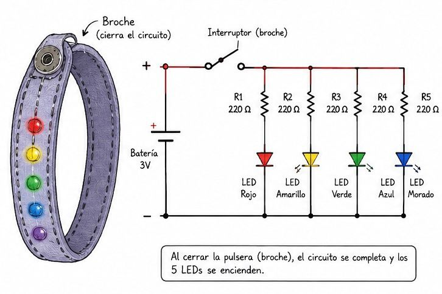
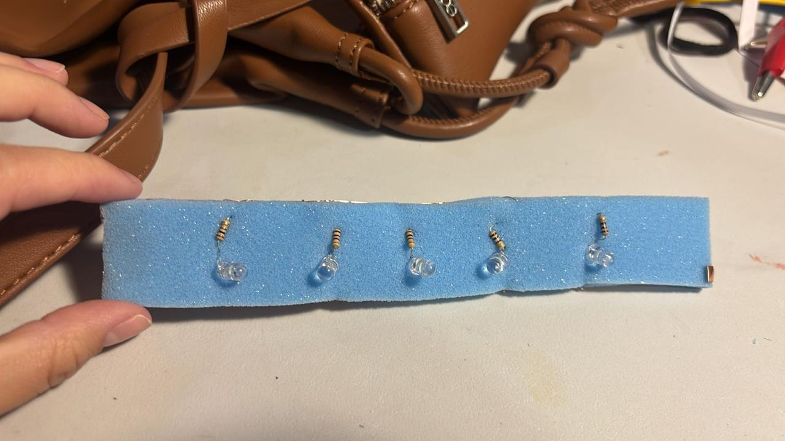
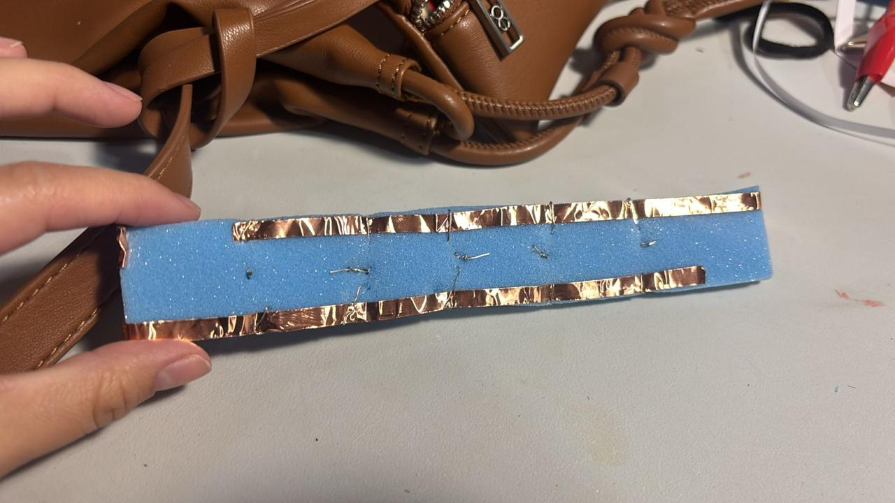
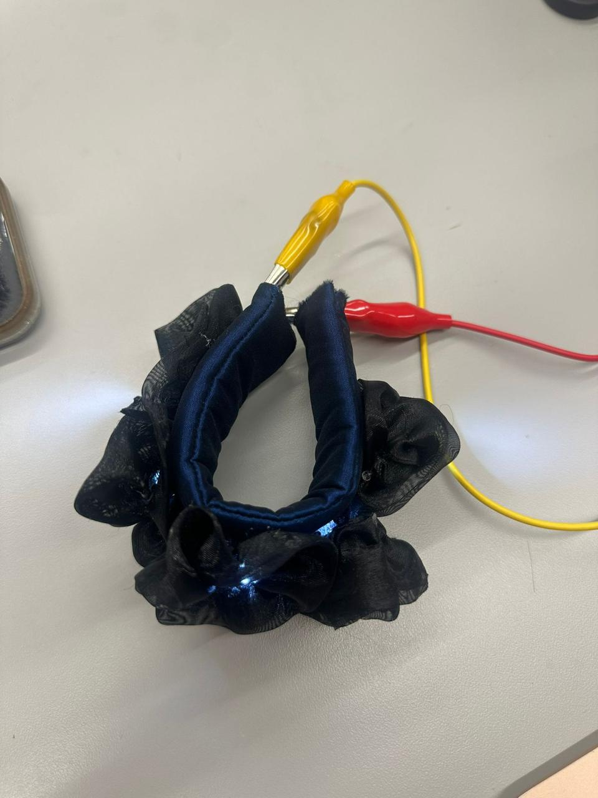
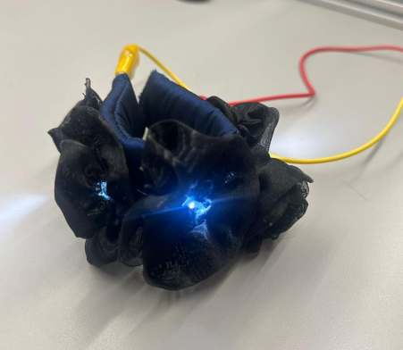

# Práctica 1: Pulsera Textil Interactiva con Hilo Conductor
---

## Objetivo

Diseñar y construir una pulsera textil que integre materiales conductivos y componentes electrónicos básicos, de modo que **cinco LEDs de colores diferentes se enciendan automáticamente al sujetarla en la muñeca**.

---

## Requisitos técnicos

- Uso obligatorio de **hilo conductor** para las conexiones
- Integrar **5 LEDs de colores diferentes**
- El encendido debe ocurrir **únicamente al cerrar la pulsera**
- El circuito debe estar **integrado al textil**, no montado como objeto rígido externo
- La pulsera debe poder colocarse y retirarse del cuerpo con facilidad

## Requisitos de diseño

- La pulsera debe ser cómoda, flexible y adecuada para la muñeca
- Evitar bordes rígidos o componentes que puedan causar molestia
- La estética es libre, pero debe evidenciar una intención de diseño

---

## Rúbrica de evaluación

| Criterio | Porcentaje |
|---|---|
| **Concepto:** Descripción de la intención de diseño | 10% |
| **Metodología de diseño:** Proceso, arquitectura electrónica e integración diseño-ingeniería | 30% |
| **Proceso de manufactura:** Fabricación, iteraciones y prototipos. LEDs encendidos al abrochar; ajuste y comodidad | 30% |
| **Evidencia (fotos y videos):** Descripción y explicación | 20% |
| **Conclusiones:** Reflexión crítica | 10% |

---

## 1. Concepto

> El concepto de diseño de esta práctica consistió en crear una pulsera textil interactiva inspirada en la estética del festival de música electrónica Electric Daisy Carnival (EDC). La intención fue diseñar un accesorio wearable que evocara la atmósfera nocturna, colorida y luminosa característica de este evento, en el que las luces y los elementos decorativos forman parte fundamental de la experiencia visual.

La pulsera fue concebida como un complemento llamativo y funcional que, al colocarse en la muñeca y cerrarse, encendiera automáticamente cinco LEDs de distintos colores. Estos LEDs simbolizan las luces vibrantes y los efectos visuales presentes en los escenarios del festival. Para reforzar esta idea, se utilizó tela satinada de color azul oscuro como recubrimiento exterior, representando el cielo nocturno, y se añadieron flores elaboradas con tela de tul que difuminaban la luz de los LEDs y aportaban un aspecto ornamental y festivo.

El resultado buscó combinar tecnología, moda y expresión estética, integrando componentes electrónicos de manera discreta dentro de una pulsera cómoda, flexible y visualmente atractiva.

---

## 2. Metodología de diseño

> El desarrollo de la pulsera siguió una metodología de diseño basada en la definición de una experiencia visual y en la integración entre materiales textiles y componentes electrónicos.

En primer lugar, se estableció la intención de diseño tomando como referencia la estética del festival EDC, caracterizada por luces multicolores, decoración llamativa y una ambientación nocturna. A partir de esta inspiración, se determinó que la pulsera debía encenderse automáticamente al cerrarse sobre la muñeca, generando un efecto luminoso inmediato.

Posteriormente, se seleccionó un material base tipo foami o esponja debido a su ligereza, flexibilidad y capacidad para alojar los LEDs y las resistencias en su interior. Sobre esta base se colocaron dos tiras de cinta conductora magnética: una destinada a la línea positiva de alimentación y otra a la conexión a tierra (GND). Estas tiras permitieron distribuir la corriente eléctrica a todos los componentes.

El sistema de encendido se resolvió mediante un par de imanes ubicados en los extremos de la pulsera. Cuando la pulsera se abrocha, los imanes hacen contacto y cierran el circuito, permitiendo el paso de corriente desde la batería hacia los cinco LEDs conectados en paralelo con sus respectivas resistencias.

Finalmente, se integró la parte estética recubriendo la estructura con tela satinada azul oscuro y flores de tul, las cuales ocultaron parcialmente los componentes electrónicos y difundieron la luz emitida por los LEDs.

### Diagrama del circuito

> Agrega aquí un esquemático o fotografía del diagrama de circuito.

```
> 
```

---

## 3. Proceso de manufactura

> El proceso de manufactura inició con el corte de una tira de material tipo foami o esponja con las dimensiones adecuadas para ajustarse cómodamente a la muñeca. En esta base se realizaron cavidades para alojar los cinco LEDs y sus resistencias, de manera que los componentes quedaran protegidos y firmemente sujetos.

Posteriormente, se colocaron dos tiras de cinta conductora magnética a lo largo de la pulsera: una para la línea positiva y otra para tierra. Cada LED fue conectado en paralelo mediante su resistencia correspondiente, uniendo sus terminales a las tiras conductoras.

Después, se conectó el portabatería a las líneas de alimentación y se instalaron imanes en los extremos de la pulsera para funcionar como mecanismo de cierre e interruptor. Se verificó que, al unir ambos extremos, los imanes completaran correctamente el circuito y encendieran los cinco LEDs.

Una vez comprobado el funcionamiento eléctrico, la pulsera se recubrió con tela satinada azul oscuro, cuidando que los componentes quedaran ocultos sin afectar la flexibilidad del accesorio. Finalmente, se añadieron flores decorativas de tul sobre la superficie, cubriendo los LEDs y creando un efecto de iluminación difusa.

Como etapa final, se realizaron pruebas de ajuste, comodidad y funcionamiento, confirmando que la pulsera encendiera correctamente al cerrarse y que mantuviera la estética inspirada en el festival EDC.

### Materiales utilizados

| Material | Función |
|---|---|
| Hilo conductor | Conexiones eléctricas |
| 5 LEDs (rojo, verde, azul, amarillo, blanco) | Indicadores visuales |
| Batería | Alimentación |
| Tela base | Soporte textil |
| Broche / cierre | Interruptor de encendido |

### Proceso paso a paso

> 
> 
> 
---

## 4. Evidencia

> 

---

## 5. Conclusiones

> ✏️ _Reflexiona críticamente sobre el proceso y el resultado. ¿Qué funcionó bien? ¿Qué cambiarías? ¿Qué aprendiste?_
