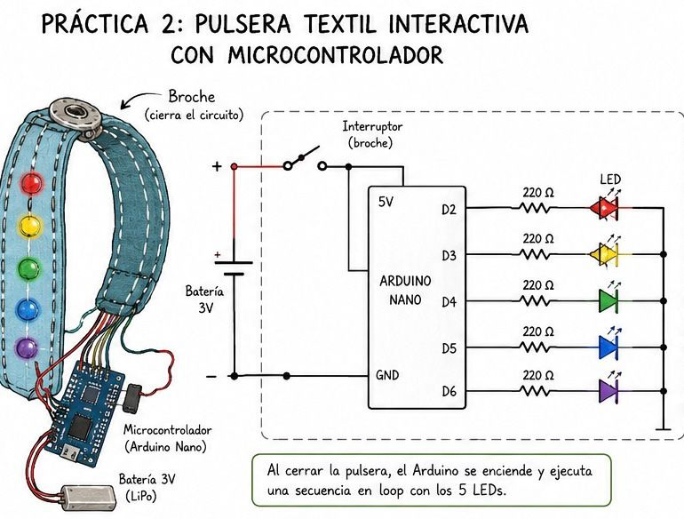
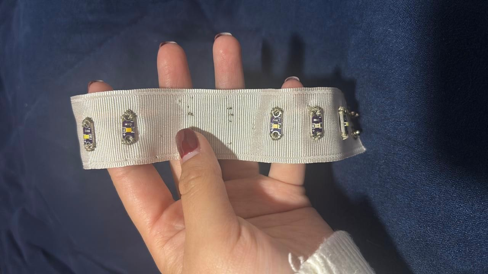
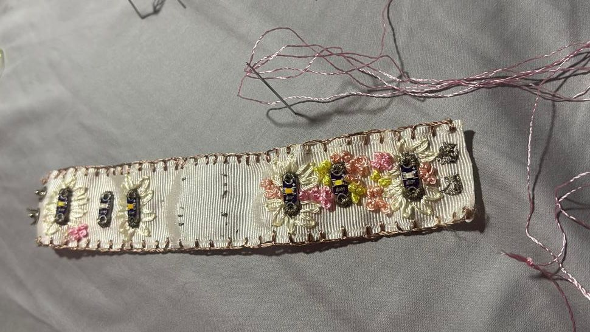
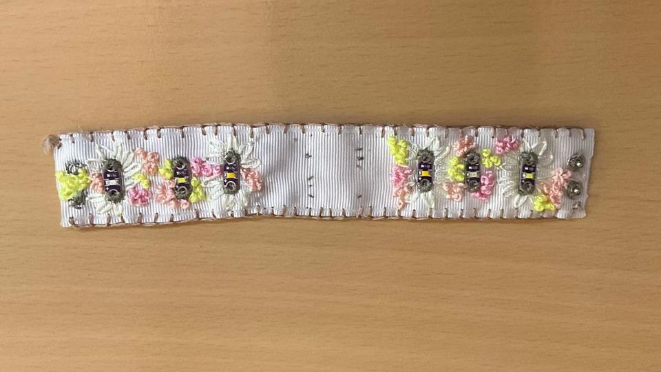
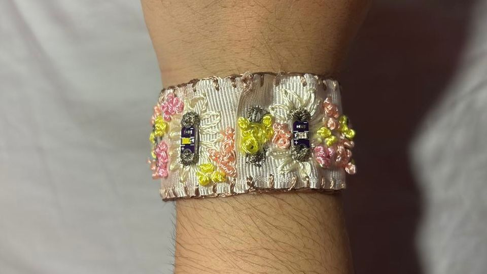

# Práctica 2: Pulsera Textil Interactiva con Microcontrolador
---

## Objetivo

Partiendo de las metodologías **Design Thinking** y **Pahl & Beitz**: programar y prototipar una pulsera wearable que exprese una intención de diseño mediante una **secuencia temporal de encendido/apagado de 5 LEDs** controlados por un microcontrolador.

---

## Requisitos técnicos

- Integrar **5 LEDs**
- La secuencia debe iniciar **únicamente al cerrar la pulsera** y funcionar en loop
- Para el prototipo, el microcontrolador puede ubicarse fuera de la pulsera

## Requisitos de diseño

- La pulsera debe ser cómoda, flexible y adecuada para la muñeca
- Evitar bordes rígidos o componentes que puedan causar molestia
- La pulsera interactiva debe **comunicar o provocar una experiencia/intención** mediante la secuencia de encendido

---

## Rúbrica de evaluación

| Criterio | Porcentaje |
|---|---|
| **Concepto:** Descripción de la intención de diseño | 10% |
| **Metodología de diseño:** Proceso, arquitectura electrónica e integración | 30% |
| **Proceso de manufactura:** LEDs integrados con intención; secuencia inicia al abrochar; comodidad | 30% |
| **Evidencia (fotos y videos)** | 20% |
| **Conclusiones:** Reflexión crítica | 10% |

---

## 1. Concepto

Para la segunda práctica se retomó la inspiración en el festival de música electrónica Electric Daisy Carnival (EDC), pero con una propuesta visual más elaborada y colorida. El concepto se basó específicamente en la temática floral del EDC 2025, en la que predominaban flores, colores vibrantes y elementos decorativos que representaban naturaleza, luz y movimiento.

La intención de diseño fue crear una pulsera wearable interactiva que combinara tecnología y estética, generando una secuencia de luces dinámica que evocara la energía del festival. A diferencia de la primera práctica, en esta versión los cinco LEDs no solo se encendían al cerrar la pulsera, sino que ejecutaban un patrón de encendido y apagado controlado por un microcontrolador, simulando el ritmo y la frecuencia de la música electrónica.

La pulsera se confeccionó sobre una base de listón textil, lo que permitió obtener un accesorio más ligero, flexible y elegante. La decoración floral y el uso de colores intensos reforzaron la inspiración en el EDC 2025, mientras que la integración del microcontrolador Seeed Studio Seeed Studio XIAO ESP32S3
 permitió dotar a la pulsera de una interacción más sofisticada.

---

## 2. Metodología de diseño

El desarrollo de esta práctica comenzó con la definición de una nueva intención estética basada en la temática floral del EDC 2025. Se buscó crear un accesorio más llamativo y detallado, que transmitiera la combinación de naturaleza, color y efectos luminosos característica del festival.

Posteriormente, se seleccionó un listón textil como estructura principal de la pulsera, ya que ofrecía flexibilidad, comodidad y facilidad de costura. Sobre esta base se planificó la ubicación de los cinco LEDs y sus resistencias, así como las rutas del hilo conductor necesarias para conectar todos los componentes.

La integración electrónica se diseñó utilizando el microcontrolador Seeed Studio XIAO ESP32S3
, el cual fue programado para generar una secuencia repetitiva de encendido y apagado de los LEDs. El cierre de la pulsera funcionó como interruptor de activación, de manera que al abrocharla se energizaba el sistema y comenzaba automáticamente la secuencia en loop.

Finalmente, se incorporaron elementos decorativos florales y acabados textiles que ocultaron parcialmente los componentes electrónicos y reforzaron la identidad visual inspirada en el EDC.rónica y cómo se integra el microcontrolador._

### Diagrama del circuito

> 

---

## 3. Código de programación

> Código implementado.

```cpp
// Práctica 2 — Pulsera con microcontrolador
// Descripción: Secuencia de 5 LEDs activada por cierre de pulsera

// Pines de los 5 LEDs
int leds[] = {2, 3, 4, 5, 6};
int numLeds = 5;

void setup() {
  for (int i = 0; i < numLeds; i++) {
    pinMode(leds[i], OUTPUT);
    digitalWrite(leds[i], LOW);
  }
}

void loop() {
  // Encendido secuencial
  for (int i = 0; i < numLeds; i++) {
    digitalWrite(leds[i], HIGH);
    delay(150);
    digitalWrite(leds[i], LOW);
  }

  // Encendido inverso
  for (int i = numLeds - 1; i >= 0; i--) {
    digitalWrite(leds[i], HIGH);
    delay(150);
    digitalWrite(leds[i], LOW);
  }
}
```
---

## 4. Proceso de manufactura

El proceso de manufactura inició con el corte del listón textil a la medida de la muñeca. Posteriormente, se marcaron las posiciones de los cinco LEDs y del hilo conductor, definiendo las trayectorias para las conexiones eléctricas.

A continuación, se cosieron los LEDs y las resistencias utilizando técnicas de bordado y costura con hilo conductor, asegurando que cada componente quedara firmemente sujeto al textil. También se integraron las conexiones hacia el microcontrolador XIAO ESP32S3 y la fuente de alimentación.

Una vez completado el ensamblaje, se programó el microcontrolador para ejecutar una secuencia de encendido y apagado de los LEDs con un patrón rítmico y repetitivo. Se realizaron pruebas para verificar que el sistema iniciara correctamente al cerrar la pulsera y que la secuencia se ejecutara de manera continua.

Finalmente, se añadieron decoraciones florales y detalles de color para reforzar la temática del EDC 2025, logrando una pulsera funcional, cómoda y visualmente atractiva.

### Paso a paso 
>
>
>
---

## 5. Evidencia

> 
> <video controls width="100%">
  <source src="../assets/img/p25.mp4" type="video/mp4">
  Tu navegador no soporta la reproducción de video.
</video>

---

## 6. Conclusiones

Esta práctica permitió profundizar en la integración de diseño textil, programación y electrónica embebida. El uso del microcontrolador XIAO ESP32S3 hizo posible crear una interacción más compleja, ya que los LEDs pudieron encenderse en secuencia y generar un efecto dinámico que simulaba el ritmo de la música electrónica.

Uno de los aprendizajes más importantes fue la necesidad de coordinar el diseño estético con la arquitectura electrónica y la programación, asegurando que todos los elementos funcionaran correctamente sin afectar la comodidad ni la flexibilidad de la pulsera.

La inspiración en la temática floral del EDC 2025 aportó una identidad visual clara y coherente, permitiendo desarrollar un accesorio que combinó tecnología, moda y creatividad. La decoración con flores y colores vibrantes, junto con la secuencia luminosa, logró transmitir la atmósfera festiva y energética del evento.

En conclusión, la práctica cumplió exitosamente con los objetivos establecidos, demostrando que es posible diseñar wearables interactivos que integren electrónica, textiles y programación para crear experiencias visuales atractivas y funcionales.
