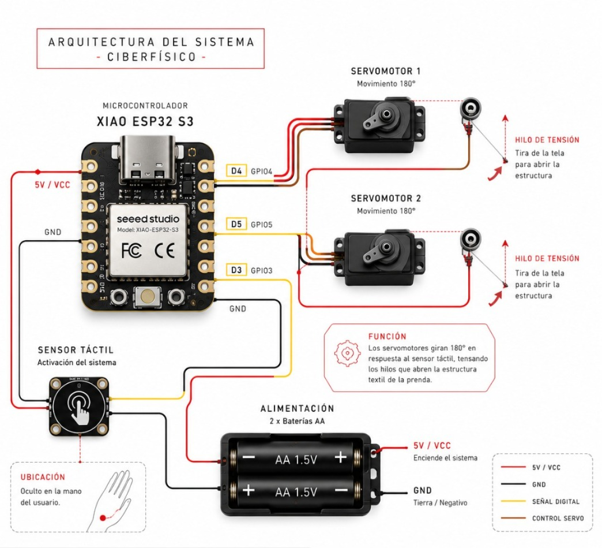

# Metodología de Diseño y Arquitectura Electrónica
{: .fs-7 }

---

## Metodología: Design Thinking

El proceso de diseño siguió la metodología **Design Thinking** adaptada al contexto de wearables:

### 1. Empatizar
Investigación sobre manifestaciones sociales, sus características visuales y las emociones que generan. Análisis de referentes de moda experimental y arte performático.

### 2. Definir
**Problema central:** Crear una prenda que transmita físicamente al espectador la tensión y liberación emocional de una manifestación, sin depender de texto ni sonido — solo a través del movimiento y la forma.

### 3. Idear
- Exploración de siluetas volumétricas y estructuras transformables
- Concepto inicial: sistema neumático para inflar la tela
- Concepto final: tensión textil mediante servomotores e hilos

### 4. Prototipar
Construcción iterativa de la estructura física, el sistema mecánico y la integración electrónica (ver [Manufactura](../manufactura/)).

### 5. Testear
Pruebas con la prenda ensamblada: comodidad, estabilidad estructural, respuesta del sistema mecánico, pasarela final.

---

## Metodología: Pahl & Beitz

Complementariamente, se aplicaron las fases de la metodología de diseño de ingeniería Pahl & Beitz:

| Fase | Aplicación en el proyecto |
|---|---|
| **Planificación y aclaración de la tarea** | Definición de requisitos técnicos y estéticos |
| **Diseño conceptual** | Bocetos de estructura y exploración de sistemas mecánicos |
| **Diseño de forma** | Desarrollo de la arquitectura física y selección de materiales |
| **Diseño de detalle** | Especificaciones electrónicas, dimensiones finales, código |

---

## Requisitos técnicos del sistema

| Requisito | Especificación |
|---|---|
| Microcontrolador | XIAO ESP32 S3 |
| Actuadores | 2 servomotores de rotación continua 360° |
| Sensor | Táctil capacitivo (pin D3) |
| Alimentación | 2 baterías AA (3V total) |
| Voltaje de operación | 5V (regulado) |
| Consumo estimado | ~500–700 mA durante activación |

---

## Arquitectura electrónica del sistema

### Diagrama de conexiones

```
                    ┌─────────────────────────┐
                    │      XIAO ESP32 S3      │
                    │                         │
2x Bat. AA ──5V/VCC─┤ 5V                  D4 ├──── Servo Motor 1
           ──GND────┤ GND                 D5 ├──── Servo Motor 2
                    │                     D3 ├──── Sensor Táctil
                    └─────────────────────────┘
```

### Descripción funcional

| Componente | Pin | Función |
|---|---|---|
| XIAO ESP32 S3 | — | Microcontrolador principal |
| Servo Motor 1 | D4 (GPIO4) | Movimiento de apertura — lado derecho |
| Servo Motor 2 | D5 (GPIO5) | Movimiento de apertura — lado izquierdo |
| Sensor Táctil | D3 (GPIO3) | Activación del sistema |
| Baterías AA (×2) | 5V / GND | Alimentación del sistema |

### Lógica de interacción

1. El sistema monitorea constantemente el sensor táctil
2. Al detectar contacto en la mano del usuario, activa ambos servos
3. Los servos generan tensión en los hilos cruzados conectados a la estructura
4. La estructura de organza se abre, revelando parcialmente el rostro
5. Los servos regresan a posición inicial tras completar el movimiento

---

## Estructura física de la prenda

| Componente | Material / Descripción |
|---|---|
| **Aro superior** | Alambre galvanizado semicircular, pintado negro |
| **Organza** | Negra y roja, translúcida |
| **Tiras colgantes** | Tela tipo cordón |
| **Cinturón estructural** | PVC termoformado |
| **Top** | Tela con integración de electrónica |
| **Pantalón** | Tela teñida en degradado rojo |

---

## Imágenes de arquitectura

> 
