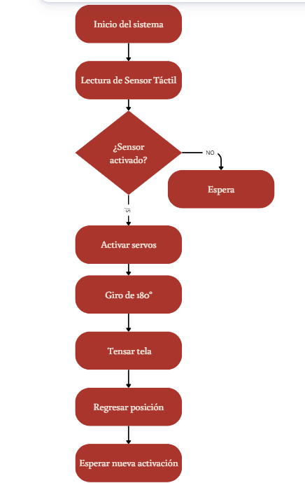

# Programación
{: .fs-7 }

---

## Descripción del sistema

La programación fue desarrollada en **Arduino IDE** utilizando el microcontrolador **XIAO ESP32 S3**.

El sistema funciona mediante la lectura de un sensor táctil oculto en la mano del usuario. Cuando el sensor detecta contacto, el microcontrolador activa dos servomotores conectados a la estructura superior de la prenda. Los servomotores generan tensión sobre los hilos de la tela translúcida para producir la apertura mecánica.

---

## Diagrama de flujo

>
---

## Código completo

```cpp
/*
 * =================o=========================================
 * Wearable Diseño Avant Garde
 * Dispositivos de Tecnología Corporal — IE115
 * Universidad Iberoamericana — Primavera 2026
 * 
 * Integrantes:
 *   Martha Valdés
 *   Nahomi Cruz
 *   Annette Cunillé
 * 
 * Descripción:
 *   Sistema de activación mediante sensor táctil que controla
 *   dos servomotores de rotación continua (360°) para tensar
 *   los hilos conectados a la estructura textil superior de
 *   la prenda, generando una apertura dinámica.
 * 
 * Hardware:
 *   - XIAO ESP32 S3
 *   - Servo Motor 1 → Pin D4 (GPIO4)
 *   - Servo Motor 2 → Pin D5 (GPIO5)
 *   - Sensor Táctil  → Pin D3 (GPIO3)
 *   - Alimentación  → 2x baterías AA (3V → regulado a 5V)
 * ============================================================
 */

#include <ESP32Servo.h>

// ── Configuración de pines ─────────────────────────────────
const int PIN_SENSOR  = 3;   // D3 — Sensor táctil capacitivo
const int PIN_SERVO1  = 4;   // D4 — Servo motor 1
const int PIN_SERVO2  = 5;   // D5 — Servo motor 2

// ── Parámetros de movimiento ───────────────────────────────
// Para servos de rotación continua:
//   90  = parado
//   0   = giro máximo en sentido antihorario
//   180 = giro máximo en sentido horario
const int SERVO_STOP     = 90;
const int SERVO_ABRIR_1  = 180;   // dirección apertura servo 1
const int SERVO_ABRIR_2  = 0;     // dirección apertura servo 2 (cruzado)
const int SERVO_CERRAR_1 = 0;     // dirección retorno servo 1
const int SERVO_CERRAR_2 = 180;   // dirección retorno servo 2

const int TIEMPO_APERTURA = 600;  // ms que duran girando al abrir
const int TIEMPO_RETORNO  = 600;  // ms que duran girando al cerrar
const int PAUSA_ABIERTO   = 1000; // ms de pausa con la tela abierta

// ── Objetos ────────────────────────────────────────────────
Servo servo1;
Servo servo2;

// ── Variables de estado ────────────────────────────────────
bool sistemaActivo = false;

// ──────────────────────────────────────────────────────────
void setup() {
  Serial.begin(115200);

  // Configurar sensor
  pinMode(PIN_SENSOR, INPUT);

  // Configurar servos
  servo1.attach(PIN_SERVO1);
  servo2.attach(PIN_SERVO2);

  // Asegurar posición inicial
  servo1.write(SERVO_STOP);
  servo2.write(SERVO_STOP);

  Serial.println("Sistema Wearable Avant Garde — Listo");
}

// ──────────────────────────────────────────────────────────
void loop() {
  int estadoSensor = digitalRead(PIN_SENSOR);

  // Activar solo si sensor detecta contacto y sistema no está en secuencia
  if (estadoSensor == HIGH && !sistemaActivo) {
    sistemaActivo = true;
    ejecutarSecuencia();
    sistemaActivo = false;
  }

  delay(50);  // pequeña pausa para estabilidad
}

// ──────────────────────────────────────────────────────────
// Función principal: ejecuta la secuencia de apertura y cierre
void ejecutarSecuencia() {
  Serial.println("Activando apertura...");
  abrirEstructura();

  Serial.println("Estructura abierta — esperando...");
  delay(PAUSA_ABIERTO);

  Serial.println("Cerrando estructura...");
  cerrarEstructura();

  Serial.println("Ciclo completo — esperando nueva activación.");
}

// ──────────────────────────────────────────────────────────
// Abre la estructura textil tensando los hilos
void abrirEstructura() {
  servo1.write(SERVO_ABRIR_1);
  servo2.write(SERVO_ABRIR_2);
  delay(TIEMPO_APERTURA);
  servo1.write(SERVO_STOP);
  servo2.write(SERVO_STOP);
}

// ──────────────────────────────────────────────────────────
// Regresa la estructura a la posición inicial
void cerrarEstructura() {
  servo1.write(SERVO_CERRAR_1);
  servo2.write(SERVO_CERRAR_2);
  delay(TIEMPO_RETORNO);
  servo1.write(SERVO_STOP);
  servo2.write(SERVO_STOP);
}
```

---

## Librerías necesarias

Para compilar este código en Arduino IDE, instala la librería:

- **ESP32Servo** — disponible en el gestor de librerías de Arduino IDE  
  (Buscar: `ESP32Servo` de Kevin Harrington)

### Configuración de la placa
1. Agrega el soporte de ESP32 en Arduino IDE (URL: `https://raw.githubusercontent.com/espressif/arduino-esp32/gh-pages/package_esp32_index.json`)
2. Selecciona **XIAO_ESP32S3** en el menú de placas

---

## Notas de calibración

> Si los servos no se detienen exactamente en la posición de reposo, ajusta el valor `SERVO_STOP` (prueba entre 88–92 según el servo específico).

> Los tiempos `TIEMPO_APERTURA` y `TIEMPO_RETORNO` dependen de la tensión de los hilos. Ajusta incrementalmente hasta lograr la apertura visual deseada.

---

